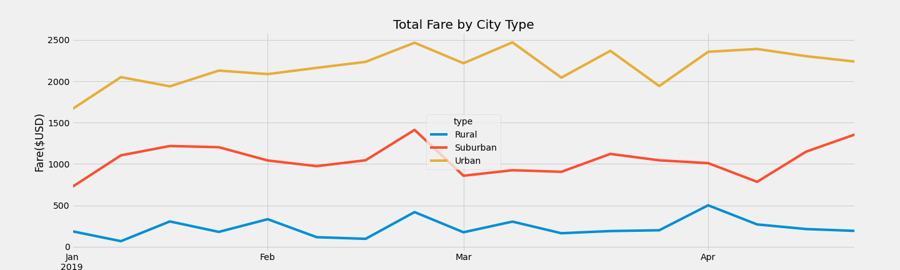

# PyBer Analysis

## 1. Overview of the analysis
This project summarizes ride-sharing data by city type.

The Ride Sharing Analysis reports on:

* The Total Rides, Total Drivers, Total Fares for each city type
* The Average Fare per Ride and Average Fare per Driver for each city type
* The total weekly fares for each city type
* Business recommentations for addressing disparities among city type

## 2.Result
**As per the analysis**

* It shows that Urban area have higher number of rides but Average Fare per ride is less than Rural area. ($24.53 vs $34.62)
* In Urban cities, the total fares are higher than Rural and Suburban cities. ($39,854.38 vs $4,327.93) ,($39,854.38 vs 19,356.33)
* In Urban cities the Average Fare per driver is less as compared to Rural cities. ($16.57 vs $55.49)

**In Multiple line chart**

* We can get information on weekly basis of "Total fare by city type" within the given timeframe that is January 2019 to April 2019.
* It shows ride-sharing company has more total fares and profits in urban cities than in suburban and rural cities.
* In below chart it shows urban cities has reached its total fare to $ 2500 in the month of Feb itself but for rural area maximum total fare reached to $500 in month of April.

## 3.Summary

**Based on the results, we would make the following recommendations to reduce the differences between city types**

* Reduce total drivers in Urban cities. During the sample period, there were more drivers than rides in Urban cities. This is the only city type where this occured. Reducing drivers in Urban cities will cause the average fare per ride and average fare per driver in Urban cities to increase.

* Increase total drivers in Rural cities. Increasing total drivers in Rural cities will cause the average fare per ride and average fare per driver in Rural cities to increase.

* Increase marketing in Rural and Suburban cities. Rural cities have the highest average fares per ride and per driver. Increased mrketing will cause more rides which should help to increase the total weekly average fares in both Rural and Suburban cities.

* Limit (furlough) driver numbers in cities when the cities have the lowest total weekly fares and increase driver numbers (hire) in cities when the cities have the highest weekly average fares. These steps should help to smooth the time series total weekly average fares.
